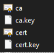
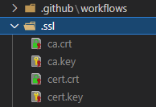
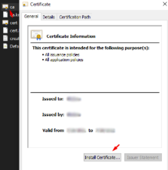
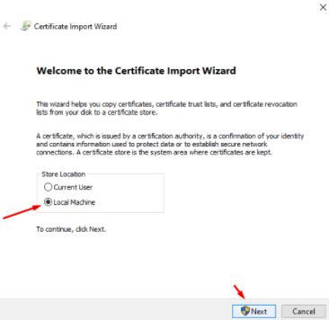
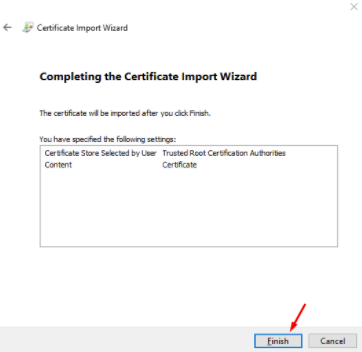
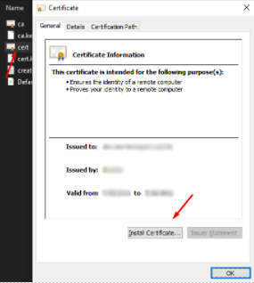
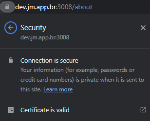

# Marvel Heroes

por [J.Meira](https://github.com/J-Meira)

Documentação e Ambiente Padrão de Desenvolvimento

## Índice

- [Introdução](#introdução)
- [Requisitos](#requisitos)
  - [Adicionar o yarn às variáveis de ambiente do sistema](#adicionar-o-yarn-às-variáveis-de-ambiente-do-sistema)
  - [Garantir permissões para o yarn](#garantir-permissões-para-o-yarn)
- [Instalação](#instalação)
  - [Instalar o mkcert](#instalar-o-mkcert)
  - [Criar os certificados](#criar-os-certificados)
  - [Clonar o repositório](#clonar-o-repositório)
  - [Copiar os certificados para a pasta do projeto](#copiar-os-certificados-para-a-pasta-do-projeto)
  - [Instalar os certificados](#instalar-os-certificados)
- [Configuração](#configuração)
  - [Criar o arquivo .env](#criar-o-arquivo-env)
  - [Editar os arquivos de host do Windows](#editar-os-arquivos-de-host-do-windows)
  - [Fazer login no repositório de pacotes do GitHub](#fazer-login-no-repositório-de-pacotes-do-github)
- [Uso](#uso)
  - [Instalar as dependências](#instalar-as-dependências)
  - [Observações](#observações)
  - [Executar a aplicação](#executar-a-aplicação)
- [Conclusão](#conclusão)

## Introdução

Lista de Heróis da Marvel em React.

[Clique aqui](https://m-heros.jm.app.br) para acessar a demonstração publicada no servidor AWS.

Baseei a aplicação no sistema Material Designer, aproveitando minha experiência como desenvolvedor front-end sênior com foco em React com TypeScript. Para agilizar o processo de desenvolvimento, utilizei meu próprio tema de desenvolvedor chamado Mui Theme, que se alinha ao Mui Core V5. Esse tema serve como um recurso centralizado para configurar e definir componentes, permitindo que eu gerencie e mantenha vários projetos em um único lugar de forma eficiente. Se você quiser explorar o Mui Theme, pode encontrá-lo em [Mui Theme](https://mui-theme.jm.app.br). Essa abordagem não apenas melhora a consistência entre os projetos, mas também simplifica a manutenção, tornando mais fácil atualizar e personalizar os componentes conforme necessário.

Para lidar com o gerenciamento de estado local, utilizei o hook amplamente usado e conhecido 'useState' do React. Esse hook oferece uma maneira simples e intuitiva de gerenciar o estado dentro de componentes individuais. Ao utilizar 'useState', pude acompanhar e atualizar facilmente o estado, resultando em um código limpo e de fácil manutenção.

Para lidar efetivamente com o gerenciamento de estado global, demonstrei minha versatilidade ao utilizar tanto a API de contexto do React quanto o Redux. Implementei essas duas estruturas em rotas separadas dentro do projeto, chamadas '/context' e '/redux'. Essa abordagem demonstra minha capacidade de trabalhar com diferentes estruturas e me adapt

ar a vários requisitos de projeto. Ao aproveitar a API de contexto, pude gerenciar o estado em um nível mais alto e compartilhar dados entre vários componentes. Por outro lado, ao utilizar o Redux, pude estabelecer um sistema robusto e escalável de gerenciamento de estado global, aproveitando seus recursos poderosos, como middlewares e depuração de viagem no tempo. Essa combinação do uso da API de contexto e do Redux demonstra minha proficiência em selecionar as ferramentas mais adequadas com base nas necessidades e requisitos do projeto.

Pessoalmente, tenho preferência por usar o Redux devido ao seu ecossistema amplo e padrões bem estabelecidos para o gerenciamento de estados complexos. Embora eu já tenha utilizado o Redux em meus projetos, esta aplicação em particular marca a primeira vez em que o utilize em conjunto com o TypeScript. Ao incorporar o TypeScript ao fluxo de trabalho do Redux, pude aproveitar sua tipagem estática e aprimorar a experiência do desenvolvedor, garantindo um código mais robusto e livre de erros. Essa experiência exemplifica ainda mais minha adaptabilidade e disposição para explorar novas tecnologias e integrá-las perfeitamente ao meu processo de desenvolvimento.

## Requisitos

Antes de prosseguir com a instalação, verifique se você possui os seguintes pré-requisitos instalados:

- [Node.js](https://nodejs.org/en/download/)
- [Yarn](https://classic.yarnpkg.com/en/docs/install#windows-stable)

### Adicionar o yarn às variáveis de ambiente do sistema

Adicione o seguinte caminho às variáveis de ambiente do sistema:

```
C:\Users\{username}\AppData\Local\Yarn\bin
```

### Garantir permissões para o yarn

Execute o seguinte comando no PowerShell como administrador:

```bash
Set-ExecutionPolicy Unrestricted
```

Observação: Se você não deseja executar em HTTPS, você pode pular as etapas 2, 3, 5, 6 e 8.

## Instalação

### Instalar o mkcert

Para instalar o mkcert, execute o seguinte comando:

```bash
yarn global add mkcert
```

### Criar os certificados

Crie os certificados usando os seguintes comandos:

```bash
mkcert create-ca --organization "ca_name" --country-code "BR" --state "State Name" --locality "City Name"
```

```bash
mkcert create-cert --domains dev.jm.app.br
```

Resultado:



### Clonar o repositório

Clone o repositório usando o Git:

```bash
git clone https://github.com/J-Meira/marvel-heroes
```

### Copiar os certificados para a pasta do projeto

Copie os certificados para a pasta do projeto:



### Instalar os certificados

ATENÇÃO: Certifique-se de que o navegador esteja fechado antes de prosseguir.

#### CA:

<br>
<br>
<br>



#### dev.jm.app.br:



(Mesmo processo do certificado anterior)

## Configuração

### Criar o arquivo .env

Crie um arquivo `.env` no diretório raiz do projeto e adicione as seguintes variáveis de ambiente:

```bash
REACT_APP_API_URL=https://url.marvel.com/
REACT_APP_API_KEY=[marvel api key]
REACT_APP_API_HASH=[marvel hash]
REACT_APP_VERSION=v-0.0.1
REACT_APP_V_DATE=2022-02-18T20:21:52
PORT=3008
# As seguintes configurações devem ser definidas apenas se os certificados foram criados e instalados
HOST=dev.jm.app.br
HTTPS=true
SSL_CRT_FILE=./.ssl/cert.crt
SSL_KEY_FILE=./.ssl/cert.key
```

### Editar os arquivos de host do Windows

Siga estas etapas para editar os arquivos de host do Windows:

1. Abra o Bloco de Notas como administrador.
2. Abra o arquivo de host: `C:\Windows\System32\drivers\etc\hosts`
3. Adicione a seguinte linha ao final do arquivo:

```bash
#Servidores locais do React
	127.0.0.1 	dev.jm.app.br
```

4. Reinicie a máquina.

### Fazer login no repositório de pacotes do GitHub

Para fazer login no repositório de pacotes do GitHub, execute o seguinte comando:

```bash
npm login --registry=https://npm.pkg.github.com --scope=@j-meira
```

## Uso

### Instalar as dependências

Para instalar as dependências do projeto, execute o seguinte comando:

```bash
yarn
```

### Observações

Se você precisa acessar a aplicação de outra máquina na rede, remova ou renomeie a linha "HOST" no arquivo .env. Adicione o endereço IP da máquina de desenvolvimento ao arquivo de host na máquina de acesso e instale os certificados nela. Feito isso, ambas as máquinas podem acessar a aplicação usando o domínio de desenvolvimento https://dev.jm.app.br:3008.

Exemplo de entrada do arquivo de host:

```bash
#Servidores locais do React
	192.168.0.2 	dev.jm.app.br
```

### Executar a aplicação

Para executar a aplicação, utilize o seguinte comando:

```bash
yarn start
```

## Conclusão

Parabéns! Você configurou com sucesso a aplicação Marvel Heroes. Após executar a aplicação, você deve ver o resultado esperado no navegador:



Se tiver alguma dúvida ou sugestão de melhoria, entre em contato com [J.Meira](https://github.com/J-Meira).
