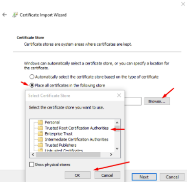
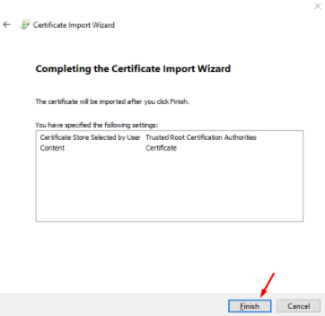
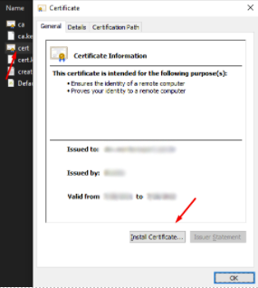

'# Marvel Heros
by [J.Meira](https://github.com/J-Meira)
Documentation and Standard Development Environment

- [0 - Introduction](#0---introduction)
- [1 - Requirements](#1---requirements)
- [2 - Install mkcert](#2---install-mkcert)
- [3 - Create certificates](#3---create-certificates)
- [4 - Clone the repository](#4---clone-the-repository)
- [5 - Copy certificates to project folder](5---copy-certificates-to-project-folder)
- [6 - Install certificates](#6---install-certificates)
- [7 - Create .env file](#7---create-env-file)
- [8 - Edit Windows host files](#8---edit-windows-host-files)
- [9 - Login on GitHub package repository](#9---login-on-gitHub-package-repository)
- [10 - Install dependencies](#10---install-dependencies)
- [11 - Observations](#12---observations)
- [12 - Run application](#11---run-application)
- [13 - Ready|](#13---ready)

## 0 - Introduction:

Marvel Heros List in React<br>

[Click here](https://m-heros.jm.app.br) to access the demo published on AWS server.<br>

## 1 - Requirements:

[Node.js](https://nodejs.org/en/download/)<br>
[Yarn](https://classic.yarnpkg.com/en/docs/install#windows-stable)<br>

### 1.1 - Add yarn to system environment variables:

C:\Users\{username}\AppData\Local\Yarn\bin

### 1.2 - Ensure permissions for yarn:

> **ATTENTION:** Execute this command in PowerShell as an administrator.

```bash
Set-ExecutionPolicy Unrestricted
```

> **Note:** If you don't want to run on HTTPS, you can skip steps (2, 3, 5, 6, and 8).

## 2 - Install mkcert:

```bash
yarn global add mkcert
```

## 3 - Create certificates:

```bash
mkcert create-ca --organization "ca_name" --country-code "BR" --state "State Name" --locality "City Name"
```

```bash
mkcert create-cert --domains dev.jm.app.br
```

### Result:


## 4 - Clone the repository:

```bash
git clone https://github.com/J-Meira/marvel-heroes
```

## 5 - Copy certificates to project folder:


## 6 - Install certificates:

> **ATTENTION:** The browser must be closed.

### 6.1 - CA:

<br>
<br>
<br>


### 6.2 - dev.jm.app.br:



[...] Same process as the previous certificate.

## 7 - Create .env file:

```bash
REACT_APP_API_URL=https://url.marvel.com/
REACT_APP_API_KEY=[marvel api key]
REACT_APP_API_HASH=[marvel hash]
REACT_APP_VERSION=v-0.0.1
REACT_APP_V_DATE=2022-02-18T20:21:52
PORT=3008
// The following should be set only if the certificates were created and installed
HOST=dev.jm.app.br
HTTPS=true
SSL_CRT_FILE=./.ssl/cert.crt
SSL_KEY_FILE=./.ssl/cert.key
```

## 8 - Edit Windows host files:

### 8.1 - Open Notepad as administrator.

### 8.2 - Open the host file:

`C:\Windows\System32\drivers\etc\hosts`

### 8.3 - Add the following line at the end of the file:

```bash
#React local servers
	127.0.0.1 	dev.jm.app.br
```

### 8.4 - Restart the machine.

## 9 - Login on GitHub package repository:

```bash
yarn login --registry=https://npm.pkg.github.com --scope=@j-meira
```

## 10 - Install dependencies:

```bash
yarn
```

## 11 - Observations!

If you need to access the application from another machine on the network, the "HOST" line should be removed or renamed from the .env file. Add the IP address of the dev machine to the host file and install the certificates on the machine that will access the application. Once this is done, both machines can access the application using the development domain https://dev.jm.app.br:3008.

```bash
#React local servers
	192.168.0.2 	dev.jm.app.br
```

## 12 - Run the application:

```bash
yarn start
```

## 13 - Ready!

Everything is set up, now you should see the following result in the browser after running the application:<br>


> If you have any questions or suggestions for improvement, please contact-me: [J.Meira](https://github.com/J-Meira).
